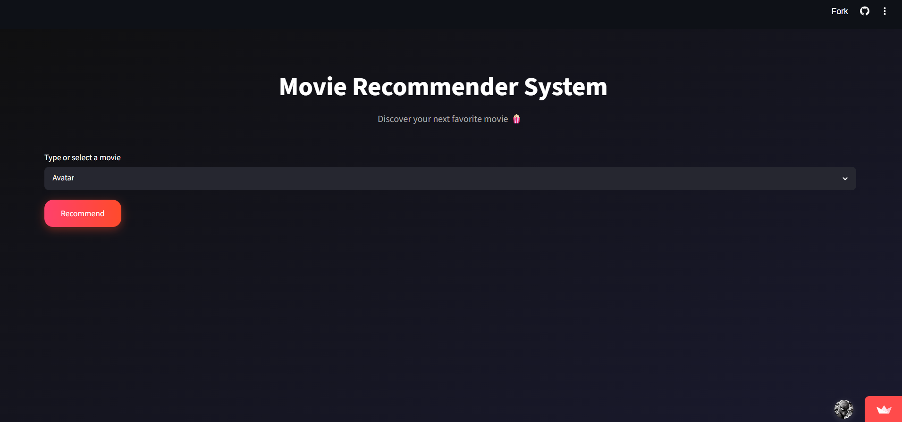
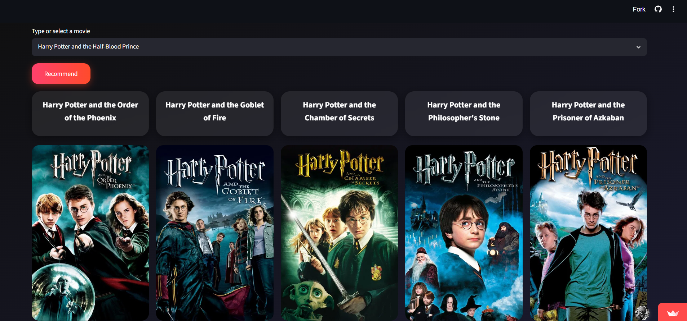
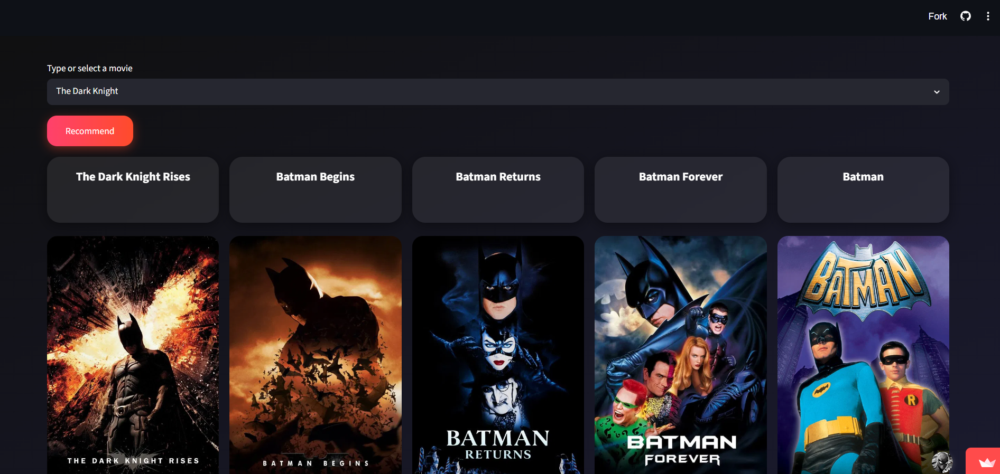
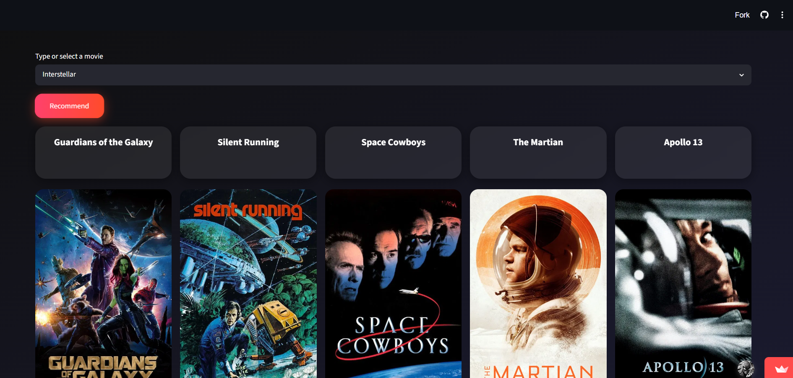

# 🎬 Movie Recommendation System

A content-based movie recommendation system built using Python and Streamlit.

---

## 🚀 Features

- Recommend similar movies
- Movie poster integration using TMDB API
- Fast recommendations
- Interactive Streamlit interface

---

## 🛠 Technologies Used

- Python
- Pandas
- NumPy
- Scikit-learn
- Streamlit
- TMDB API

---

## 📂 Project Structure

app.py

movie_recommendation.ipynb

movies_list.pkl

requirements.txt

---

## ▶ How to Run

pip install -r requirements.txt

streamlit run app.py
---

## 📈 Future Improvements

- Improve recommendation accuracy

- Add movie filtering

- Add genres

- User login system

- Better UI

---

## 📜 Note

This project was completed as a guided academic project to gain practical experience with recommendation systems, Python, machine learning workflows, and Streamlit deployment.

## 📸 Screenshots

### Home Page

### Recommendations

### Results

### Results

